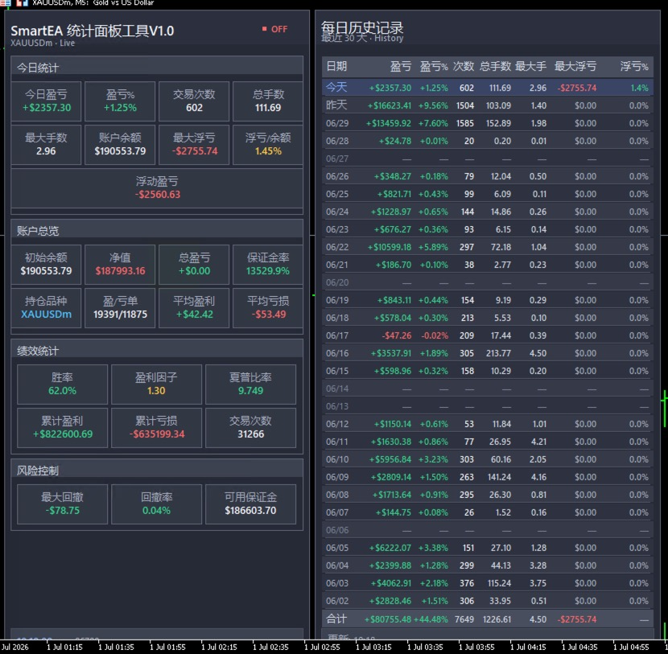

# SmartEA Monitor

**SmartEA 统计面板工具 V1.0** — 一款面向 MetaTrader 5 的 EA 运行监控面板，在图表上以半透明浮层实时展示账户绩效、风险指标与历史统计，帮助交易者快速掌握策略运行状况。



## 功能概览

### 今日统计
- 今日盈亏（金额与百分比）
- 交易次数、总手数、最大手数
- 账户余额
- 最大浮亏、浮亏/余额比例
- 当前浮动盈亏

### 账户总览
- 初始余额、净值、总盈亏
- 保证金率、持仓品种
- 盈利单 / 亏损单数量
- 平均每笔盈利 / 平均每笔亏损

### 绩效统计
- 胜率、盈利因子、夏普比率
- 累计盈利 / 累计亏损
- 历史总交易次数

### 风险控制
- 最大回撤（金额与百分比）
- 可用保证金

### 每日历史记录
- 最近 30 天逐日明细
- 每日盈亏、盈亏%、交易次数、总手数、最大手数
- 每日最大浮亏及浮亏占比
- 底部合计行汇总周期表现

## 环境要求

| 项目 | 要求 |
|------|------|
| 平台 | MetaTrader 5 |
| 账户类型 | 支持实盘 / 模拟账户 |
| 文件 | `monitor.ex5`（已编译，无需 MetaEditor） |

## 安装步骤

1. 下载本仓库中的 `monitor.ex5`。
2. 打开 MT5，依次点击 **文件 → 打开数据文件夹**。
3. 将 `monitor.ex5` 复制到以下目录之一（视加载方式而定）：
   - `MQL5/Experts/` — 作为 EA 加载
   - `MQL5/Indicators/` — 作为指标加载
4. 重启 MT5，或在导航器窗口中右键对应分类，选择 **刷新**。
5. 在目标品种图表上拖放 **SmartEA Monitor**，按提示允许算法交易（若作为 EA 使用）。

> **提示**：面板会叠加在 K 线图上方，建议在较大尺寸的图表窗口中使用，以便完整查看左侧统计区与右侧历史表格。

## 使用说明

1. 在需要监控的账户与品种图表上加载本工具。
2. 面板顶部显示当前品种与账户类型（如 `XAUUSDm · Live`）。
3. 左上角状态指示（`ON` / `OFF`）反映监控运行状态。
4. 左侧四个区块分别对应：**今日统计**、**账户总览**、**绩效统计**、**风险控制**。
5. 右侧 **每日历史记录** 表格展示近 30 日表现，周末无交易日显示为 `-`。
6. 盈亏数据以颜色区分：**绿色** 表示盈利，**红色** 表示亏损或风险项。

## 面板指标说明

| 指标 | 说明 |
|------|------|
| 今日盈亏 | 当日已平仓订单的净盈亏 |
| 最大浮亏 | 当日持仓过程中出现的最大浮动亏损 |
| 浮亏/余额 | 最大浮亏占账户余额的百分比 |
| 净值 | 账户余额 + 当前浮动盈亏 |
| 胜率 | 盈利单数 ÷ 总平仓单数 |
| 盈利因子 | 总盈利 ÷ 总亏损（绝对值） |
| 夏普比率 | 基于日收益率序列计算的风险调整后收益指标 |
| 最大回撤 | 净值曲线从峰值到谷底的最大跌幅 |

## 仓库结构

```
SmartEA-Monitor/
├── README.md      # 项目说明
├── monitor.ex5    # MT5 编译程序
└── demo.jpeg      # 界面演示截图
```

## 版本

- **V1.0** — 初始发布，包含实时统计面板与 30 日历史记录功能。

## 免责声明

本工具仅供交易监控与数据分析参考，不构成任何投资建议。外汇、贵金属等杠杆交易具有高风险，可能导致本金损失。使用本工具所产生的任何交易决策及后果，均由使用者自行承担。

## 许可证

本项目版权归作者所有。未经许可，请勿用于商业再分发。

---

如有问题或建议，欢迎在 [Issues](https://github.com/smarttang/SmartEA-Monitor/issues) 中反馈。
